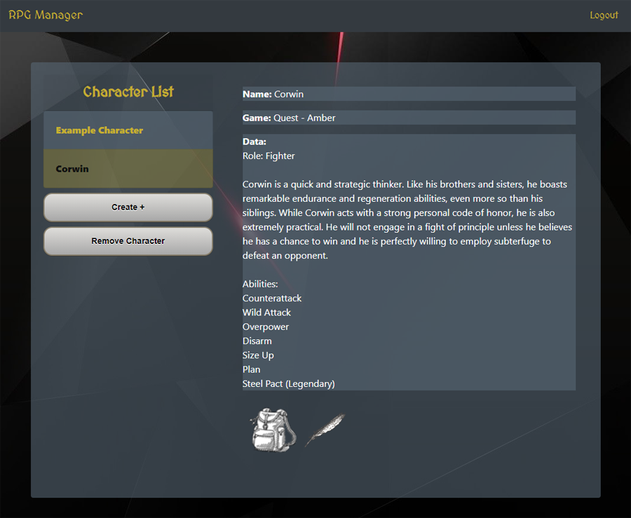

# rpg-manager
[](https://github.com/malenchite/rpg-manager/actions/workflows/main.yml)
[](https://opensource.org/licenses/ISC)
## Description
A generic manager for RPG characters and their inventories. It allows a player to keep track of character across multiple games while managing the items that character holds. Items that are created can be used across characters and accounts.

Core technologies for this application include passport, sequelize, express, and express-handlebars.

## Table of Contents
* [Installation](#Installation)
* [Usage](#Usage)
* [Screenshot](#Screenshot)
* [Deployment](#Deployment)
* [License](#License)
* [Contributors](#Contributors)
* [Credits](#Credits)

## Installation
Install the application with
```
npm install
```

The provided [schema.sql](https://github.com/malenchite/rpg-manager/blob/main/db/schema.sql) file should be used to create the initial database. Seed data will be loaded by Sequelize when the application is started.

## Usage
A MySQL database must be available, either locally or remotely. This application is designed to be deployed on Heroku with JawsDB for running MySQL. You may provide a full MySQL URL in the following environment variable:
```
JAWSDB_URL = full MySQL URL with username, password, host, database
```
or you may set values individually if you are working with a local database:
```
SEQUELIZE_USER = username for local database
SEQUELIZE_PASSWORD = password for user
SEQUELIZE_HOST = hostname of MySQL db (probably localhost)
```

The password encryption uses a salting system, so the secret value must be set via environment variable:
```
AUTH_SECRET = your SECRET salting
```

In order to initialize the database with seed data, the following environment variables must be set:
```
ADMIN_USER_PWD = password for example Admin user
FORCE_SYNC = true/false (true will overwrite the database with seed data every time the server is started)
```

The server can then be run with
```
npm start
```

## Screenshot
  

## Deployment
This application has been deployed on Heroku at https://p2-rpg-manager.herokuapp.com

## License  
This application is covered under the **ISC** license. More info can be found here: [ISC](https://opensource.org/licenses/ISC)

## Contributors:
(Tarek Behairy)[https://github.com/Tarekbe55] - Front-end design and styling
(Monica Hill)[https://github.com/acinom813] - Front-end design
(Steven Israel)[https://github.com/malenchite] - Back-end, routing, API, art
(Matthew Randolph)[https://github.com/RobeandHat] - Back-end, front-end, styling

## Credits
Starter code for server.js and user authentication provided as part of a project for the UNC Chapel Hill Coding Bootcamp.

Images: 
* Background: https://wallpaperaccess.com
* Backpack: https://pixy.org
* Feather: https://pixabay.com